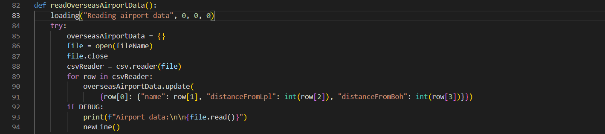
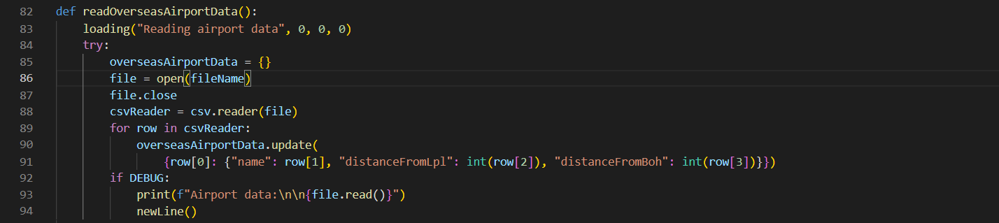

# Dark+ Python

## VsCode Dark+ theme with the same colours for python as javascript and a few extras for readability

- To allow for variable colouring, the source.python scope is set to the javascript variable colour (`#9CDCFE`) and all of the other scopes are set to other colours

- [Here](./themes/dark-plus-python-theme.json) is the theme json file where you can see all the extra colours added

- To change your theme press Ctrl K and then Ctrl T

- [Github repo](https://github.com/thowitz/dark-plus-python-theme)

## Screenshots

### Dark+ Default Theme:

### Dark+ Python Theme:

**Enjoy!**
